# Fluxo de Dados — Weather App

```mermaid
flowchart LR
    Input[SearchBar: digita cidade] --> Trim{Consulta vazia após trim?}
    Trim -- Sim --> EmptyInput[Mostra orientação; nenhuma chamada]
    EmptyInput --> SearchUI[UI de busca]
    Trim -- Não --> SearchState[useWeather: SearchState loading e consulta preservada]
    SearchState --> Geocoding[weatherService: Geocoding API]

    Geocoding --> GeoResult{Resultado do geocoding}
    GeoResult -- Erro HTTP, rede ou timeout --> GeoError[useWeather: SearchState error; mantém consulta]
    GeoError --> SearchUI
    GeoError -->|Retry manual: mesma consulta| SearchState
    GeoResult -- Lista vazia --> EmptyResult[useWeather: SearchState empty; sem erro técnico]
    EmptyResult --> SearchUI
    GeoResult -- Cidades encontradas --> SearchSuccess[useWeather: SearchState success]
    SearchSuccess --> Suggestions[SearchBar: exibe sugestões]
    Suggestions --> SelectCity{Pessoa seleciona cidade}
    SelectCity --> ActiveCity[useWeather: define cidade ativa e WeatherState loading]
    ActiveCity --> Forecast[weatherService: Forecast API por coordenadas]

    Forecast --> ForecastResult{Resposta do Forecast}
    ForecastResult -- Erro HTTP, rede ou timeout --> WeatherError[useWeather: WeatherState error]
    WeatherError --> WeatherUI[Componentes de UI: erro e retry]
    WeatherError -->|Retry manual: mesma operação| ActiveCity
    ForecastResult -- Payload inválido --> InvalidResponse[Mapeia invalid-response]
    InvalidResponse --> WeatherError
    ForecastResult -- Resposta parcial válida --> PartialData[Campos ausentes viram null]
    PartialData --> WeatherSuccess[useWeather: WeatherState success]
    ForecastResult -- Resposta válida --> WeatherSuccess
    WeatherSuccess --> Snapshot[WeatherData: cidade, atual, 5 dias e fetchedAt]
    Snapshot --> WeatherUI[Componentes de UI: clima atual e previsão]

    UnitToggle[Pessoa alterna Unit] --> Derive[Deriva °C/°F na renderização]
    Snapshot --> Derive
    Derive --> WeatherUI
    Refresh[Pessoa aciona Atualizar] --> RefreshState[useWeather: WeatherState loading com snapshot anterior]
    RefreshState --> Forecast
```

O diagrama segue FR-01 a FR-07: lista vazia é estado `empty`, falhas técnicas usam `error`, resposta parcial válida continua em `success` com campos ausentes, e conversão de unidade não gera request.